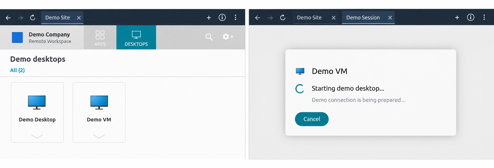

# OmaBridge

**English** | [Deutsch](README.de.md)

Automatically log in to **Citrix remote sites** from the Omarchy bar.
Save multiple sites with your username, password and optional TOTP secret, select a site,
then launch an app or virtual desktop using **Citrix Workspace** or the
**integrated HTML5 browser**.



*Combined demo illustration with fictional names and branding.*

- Credentials stored in the Linux keyring (Secret Service).
- Multi-step sign-in, including a TOTP prompt after username and password.
- A compact top bar with navigation and tabs; the remaining space is yours.

- Colors follow the Omarchy theme live, including open dialogs.
- Optional app lock with a PIN or password of your chosen length (Settings).

## Install

Requires Omarchy's **Quickshell bar**, Python 3.11+, pip/venv and a working Secret
Service such as GNOME Keyring. Native sessions need Citrix Workspace (`wfica`);
browser sessions need HTML5 enabled on the Citrix server.

```bash
git clone https://github.com/flathack/OmaBridge.git
cd OmaBridge
./scripts/install.sh
```

The installer sets up the app and bar widget under your user account.
Run it again to update. `omarchy plugin add` alone does not install the Python app.

## Use

Click **Citrix → Manage sites**, then **+**. Enter the portal's HTTPS URL
and your credentials. **TOTP storage is optional and off by default**; enter codes
manually in the portal, or enable storage using a Base32 secret or `otpauth://` link.
Storing TOTP alongside your password is insecure and your responsibility; the app
shows a warning. Choose Workspace or Browser, save, and select the site from the bar.
Choose the app or desktop in the Citrix portal. Settings are under **⋮**.
English is the default. Switch to German under **⋮ → Settings → Language**;
the preference is saved and applies without closing sessions.

## Remove

Run `omarchy plugin disable local.omabridge` to disable the widget.
Delete sites in OmaBridge first if you also want to remove saved credentials.
[Full removal instructions](docs/usage.md#removal).

## More

[User guide](docs/usage.md) · [Development](CONTRIBUTING.md) ·
[Changelog](CHANGELOG.md) · [Security review](docs/security-review.md)

Development version: portal compatibility needs testing with your Citrix setup.
The two reported code issues are fixed in 0.3.0. Marketplace approval and a license are still pending.
